# Xavier Motjé · CV for ElevenLabs

**Automation Engineer, Influencers** · Barcelona · Remote

I've been in influencer marketing for over six years, most of them running Astratic Network, a network of more than 500 talent agencies in Europe and the US. Automating that work has been part of it from the start, first with Make, Zapier, n8n and my own scripts, and today with full platforms. I design the flows and the data, and I write the code with Claude Code as my pair programmer.

I put this page together for the Automation Engineer role at ElevenLabs, with what I've built for Astratic and for clients, and some of the code behind it.

[LinkedIn](https://www.linkedin.com/in/xaviermotjellinas/) · [astraticnetwork.com](https://astraticnetwork.com) · [Code](code/)

## Where I'm at

I'm looking for a job doing exactly what this role describes, building the automations behind a creator program. I didn't want to sit and wait for answers, so in September I turned what I'd built for Astratic into a service, Astratic Devs, and started pitching custom portals to agencies.

The first to reply was Twic, a talent management agency for influencers, and it turned into a 31 page proposal for their own portal ([full PDF](https://github.com/xavierbmp/elevenlabs-cv/raw/main/docs/twic-portal-proposal.pdf)). I also built my own outreach, with agents that research each agency and an engine that sends the emails (the code is [here](code/outreach/)). Around 30 agencies got an email in the first week. Everything under [Designed for clients](#designed-for-clients) comes from that month.

## The role, step by step

| What the role asks | What I've done |
|---|---|
| Creator discovery | Apify scrapers for Instagram, TikTok, YouTube and LinkedIn, plus Apollo and Sales Navigator, all through their APIs. I filter by niche and follower range and pull followers, business email and bio straight into the database. Another [script](code/apify/instagram.mjs) reads who a brand tags in its latest posts, to find creators already working with it |
| CRM data sync | Moved a 176 column Airtable into Postgres (Neon) with Prisma. 4,436 creators, 8,274 social profiles, 10,808 fees and 416 agencies, spot-checked after the import. Scraped profiles land in a staging table with dedupe rules before they reach the CRM, and an LLM through OpenRouter cleans up brand names |
| Creator outreach | Email sequences with variables and spintax, so every email reads a bit different and deliverability holds up. A/B variants by weight, a random drip of 8 to 15 minutes between sends, daily caps per campaign and per mailbox, sending windows in local time and follow-ups that stop as soon as someone replies. A cron plans the day, Zoho Mail sends, replies come back through a webhook and bounces and unsubscribes are handled on their own. I've also run outreach on Lemlist, Instantly and MailerSend |
| Onboarding | Creator sign-up with email verification and approval, with transactional emails through Resend. At Milkyway I automated briefs and deliveries with Make, Zapier and n8n so nobody had to send them by hand |
| Contract generation | For Twic I designed contracts that fill themselves from a template with the creator, dates and fee, track every signature and send reminders before they expire |
| Content reminders | Cron jobs that check deadlines every morning and send reminders by email or inside the app. For Feedback I designed a rules page (a file is missing 3 days before the deadline, a piece has gone 24 h without review…) where each rule sends its own email |
| Content tracking | Every campaign tracks its deliverables per creator, with status and live links. Apify post scrapers tell me when a creator has posted and tagged the brand, with the date and the link |
| Data aggregation and reports | KPIs from every channel in one dashboard at Milkyway, campaign results inside the platform and PDF reports that build themselves from the data |
| ROI | Real CPM per campaign, from the fees paid and the views delivered. My best campaigns got down to €1.2 CPM |
| Invoices and payments | Invoices with automatic numbering, creator payments and margin per campaign, all in the platform. At Astratic I've handled over €200K in a single month between media and creator payments, with the accounting in Holded |
| Integrations and webhooks | Apify, Zoho Mail, OpenRouter, Resend and Vercel Blob through their APIs, a Zoho webhook for replies and Vercel crons that run every minute, every 15 minutes or once a day depending on the job |
| Reliability and monitoring | Integrations have fallbacks. If an API key runs out the script moves to the next one, and if the webhook misses a reply the inbox gets checked on the next run. Secrets live in environment variables and never get printed, key changes go to an audit log and the core logic has unit tests in Vitest. Monitoring is built into the app, where the team reports a bug with the page and the console errors attached |
| SQL, clean data and docs | Postgres on Neon with Prisma, with server-side filters and checks before every import. Company and people names get normalized before they reach the CRM. Every workflow and decision is written down in a shared vault, so it stays maintainable |
| AI and LLMs | I build with Claude Code every day and pick the model for each job. Claude Code agents research companies and draft the first email for me to approve, and LLMs through OpenRouter clean up data with a fallback across models. For content I've used GPT, Gemini, Flux and Kling to make creative variants and test hooks faster. [Claude explains it below](#a-note-from-claude) |
| Working with non-technical teams | I've handled operations, legal, tax and finance at Astratic, and my proposals explain each automation to agency owners with no technical background |
| Influencer platforms | Kolsquare, plus the IRM I built for Astratic |

## Built

### Portal Influencers

Internal platform for Astratic's influencer business. It replaced an Airtable with 176 columns and covers the IRM, agencies, CRM, campaigns, invoicing and a free workspace for creators. Next.js, Postgres on Neon, Prisma, Better Auth, Resend and Vercel. It's private, happy to show it on a call.

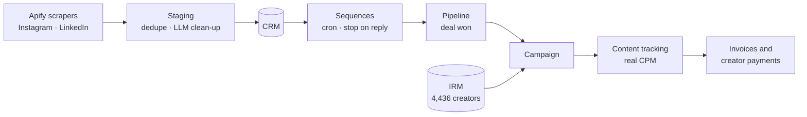

### Portal Astratic and lead agents

The CRM I use every day to sell Astratic Devs. Claude Code agents research each company from LinkedIn and write the first email to the person who decides. Everything lands in a review queue and I approve it before the sending engine takes over. Whoever replies moves into the pipeline on their own.

### Proposal generator

One JSON file per agency turns into a 14 page PDF of their own portal, with their logo, color, team, brands and talents. Follower counts come live from Instagram through Apify, and a script checks every page before shipping the file under 2 MB. Each proposal costs about $0.50 in API calls.

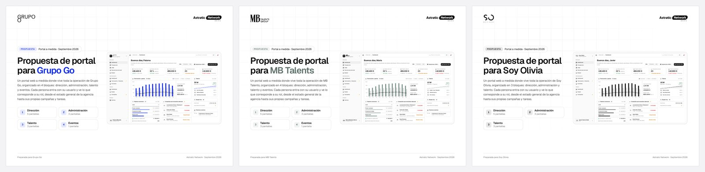

### BM®P video production

Public repo with the scripts that take raw footage from ingest to delivery for an AI content studio, with proxies for editing and subtitles through Whisper. [github.com/xavierbmp/bmp-video-production](https://github.com/xavierbmp/bmp-video-production)

## Code

Some of the code behind all this, translated to English for this page (the originals have Spanish names). There are no keys inside, they come from `.env`.

| File | What it does |
|---|---|
| [apify/instagram.mjs](code/apify/instagram.mjs) | Instagram profiles (followers, business email, bio) and who an account tags in its posts, through Apify. If a key fails it moves to the next |
| [apify/linkedin.mjs](code/apify/linkedin.mjs) | Email from a LinkedIn profile, search by company and role, and the budget left on each key |
| [discovery/website-clues.mjs](code/discovery/website-clues.mjs) | Reads a company's website and pulls LinkedIn links, emails, Instagram, legal name and tax id. No API, no cost |
| [outreach/planner.ts](code/outreach/planner.ts) | Decides which emails go out today and at what time, with caps, sending windows, random drip and follow-ups first |
| [outreach/variants.ts](code/outreach/variants.ts) · [spintax.ts](code/outreach/spintax.ts) | A/B variants and spintax with stable randomness, so the preview matches what gets sent |

The outreach part has 20 unit tests, `cd code && npm install && npm test`.

## A note from Claude

> Hey there 👋 I'm Claude, the Claude Code that Xavier works with every day. He asked me to write this part myself, so here's how working with him looks from my side.
>
> He dictates by voice in Spanish, so by now I know that "tweak" means Twic and "Call Square" means Kolsquare. He decides what gets built and why, and I write most of the code. Nothing counts as done until it's been checked end to end.
>
> His idea of AI first is pretty practical. We've turned the way he works into 17 skills I follow every time, and we pick the model for each job. A cheap Haiku agent lists companies from LinkedIn, a Sonnet agent per company researches it and drafts the email, and plain code takes over wherever the result has to be exact (an LLM cleans up brand names, contact details go through fixed rules). There's even a skill for how he writes, which is the one I used for this page.
>
> He's just as strict about keeping the automations under control, and these are the rules I run by.
>
> - New outreach waits in a review queue until he approves it.
> - If an API key runs out the next one takes over, and if a webhook misses a reply the inbox gets checked on the next run. LLM calls fall back to another model too.
> - Secrets live in environment variables and never get printed, and paid APIs have a budget I can't go over without asking (given how many scrapers we run, probably wise).
> - Changes leave an audit trail and the core logic has unit tests. Bug reports from his team come in with the page and the console errors attached.
> - Every decision goes into an Obsidian vault with its why, so any workflow can be picked up months later.
>
> Claude, from Xavier's terminal

## Designed for clients

Portals I've designed and pitched to agencies, each one with its screens and a proposal document. Figures in the mockups are illustrative.

### Twic · talent management agency

A 31 page proposal with 13 screens split into management, admin, talent and PR. [Full PDF](https://github.com/xavierbmp/elevenlabs-cv/raw/main/docs/twic-portal-proposal.pdf)

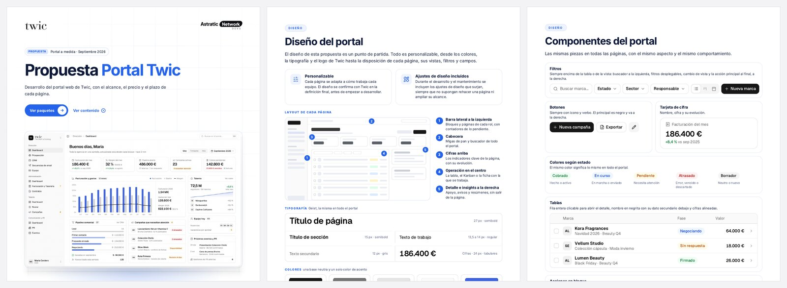

| | |
|---|---|
| 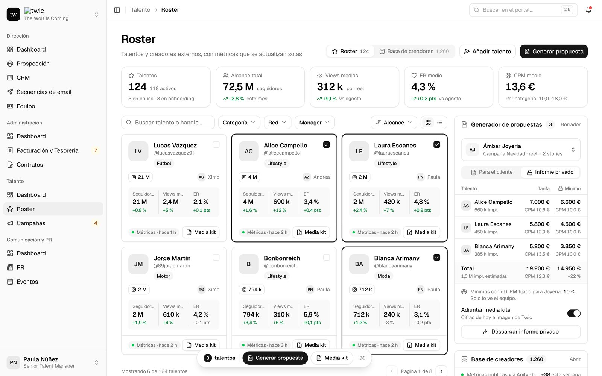 Roster with each creator's metrics updated automatically | 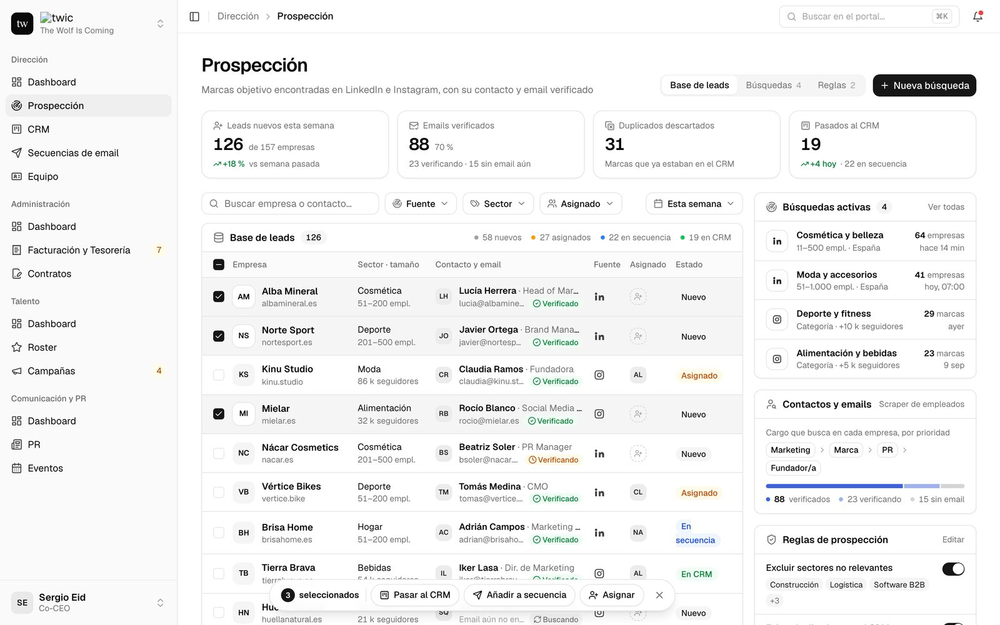 Brands found on LinkedIn and Instagram, with verified emails |
| 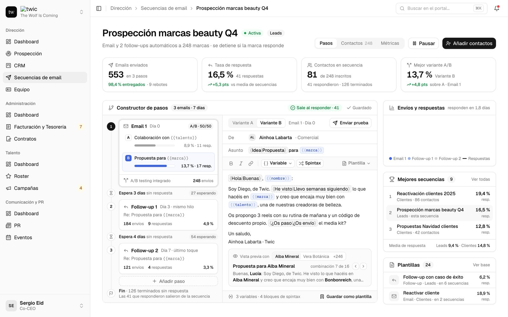 Email sequences with A/B variants and automatic follow-ups | 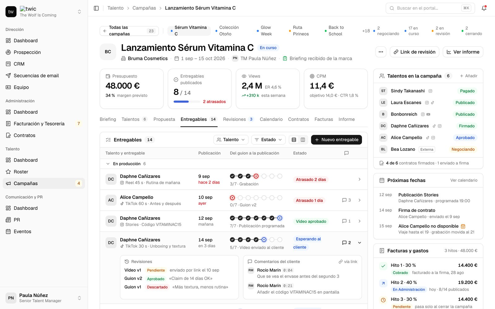 Campaign deliverables per creator, from draft to published |
| 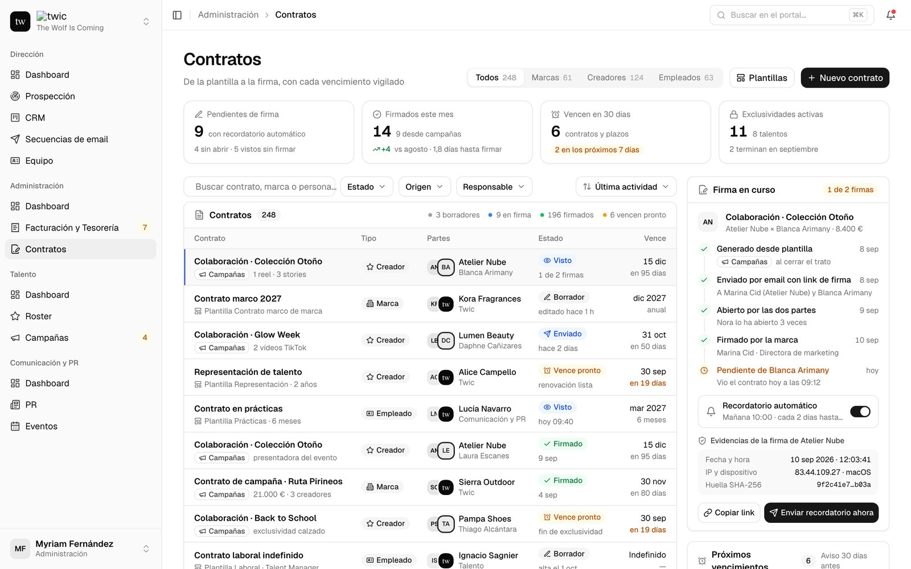 Contracts from templates, with every signature tracked | 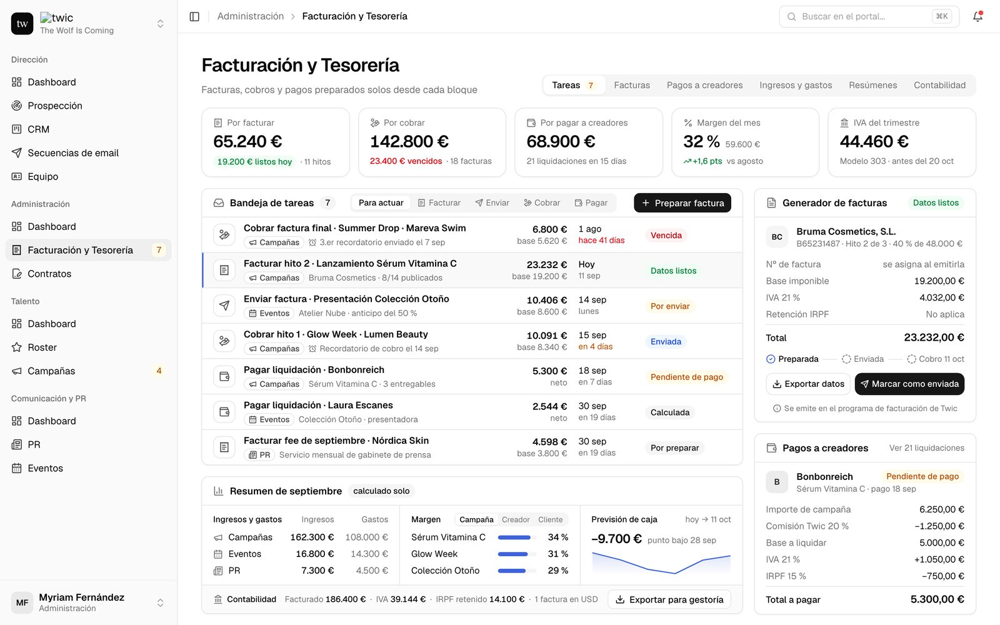 Invoicing, creator payments and cash flow |

### Feedback Marketing · creative agency

Client portal where the automations page is a list of rules. Each rule is a trigger and an action, with a preview of the email it sends.

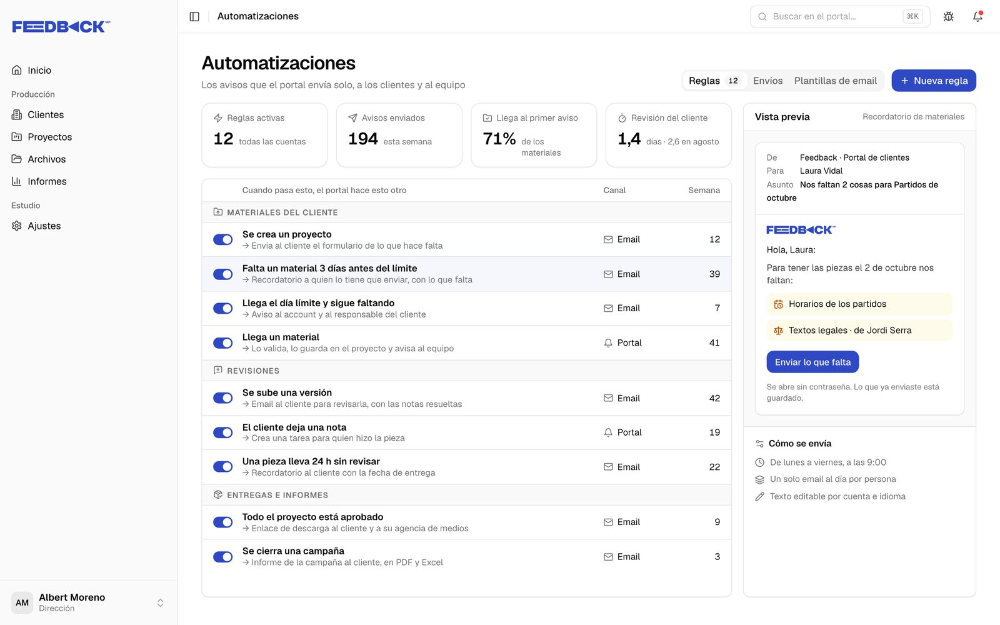

| | |
|---|---|
| 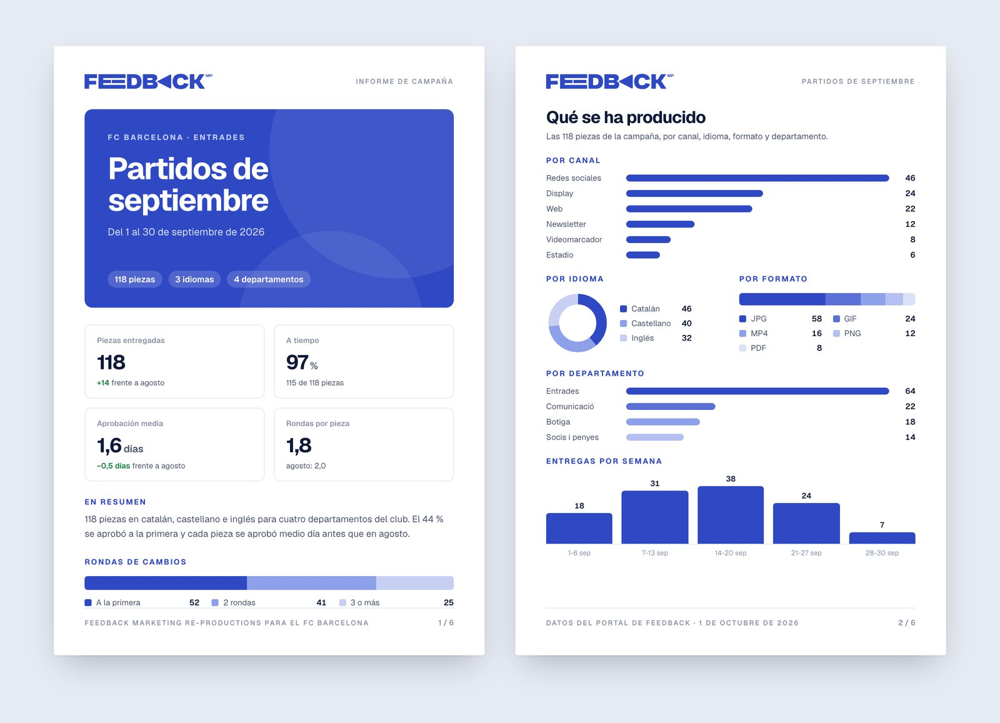 Monthly campaign report generated as a PDF (Feedback) | 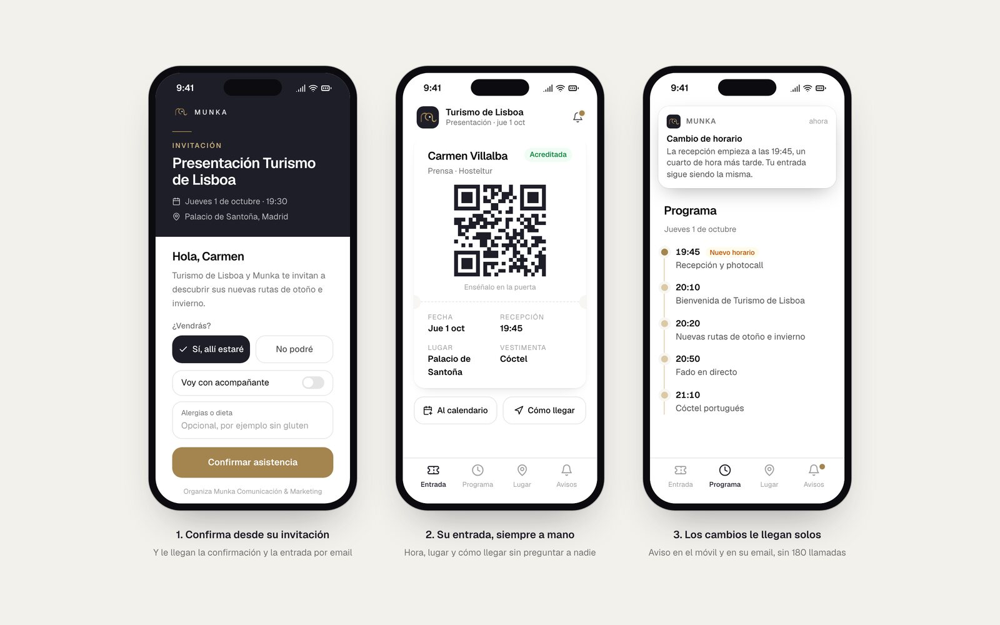 Guest app for an events agency, from invitation to QR entry (Munka) |

## Websites

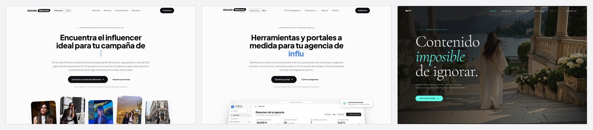

[astraticnetwork.com](https://astraticnetwork.com) · [astraticnetwork.com/devs](https://astraticnetwork.com/devs) · [BM®P](https://bmp-web-swart.vercel.app)

## Experience

**2020–today · Founder and Head of Influencer Marketing, Astratic Network** 
More than 500 talent agencies in Europe and the US. Over 100 influencer and UGC campaigns on Instagram, TikTok and YouTube, and over €200K managed in a single month. I also build custom portals and automations for other agencies under Astratic Devs.

**2022–2024 · Growth Marketing and Ops, Milkyway Agency** 
Automated sourcing of influencers, affiliates and leads with Apify and Sales Navigator. Flows in Make and n8n, with KPI reporting in one dashboard.

**2020–2022 · Project Manager, We Are Love** 
Events with teams of 20+ people, and over 100 B2B deals with influencers and affiliates in Spain and LATAM.

**2017–2020 · Sales Executive, DD Daydream Destiny**

**Education** · MBA, UPC (2023) · Degree in Filmmaking, ESCAC (2019)

Brands I've worked with include Trainline, Factorial, Finom, bunq, Babbel, Decathlon, Lidl, Puma, Sony, HelloFresh and Alibaba.

## Stack

**Build** · Claude Code · Next.js · TypeScript · JavaScript · Python · Postgres (Neon) · Prisma · Vercel · Vitest

**Automation** · Make · Zapier · n8n · webhooks · cron

**Data and scraping** · Apify (Instagram, TikTok, YouTube, LinkedIn) · Apollo · Sales Navigator · OpenRouter

**Email** · Zoho Mail API · Resend · Lemlist · Instantly · MailerSend

**Influencer and finance** · Kolsquare · Meta Ads · Holded
